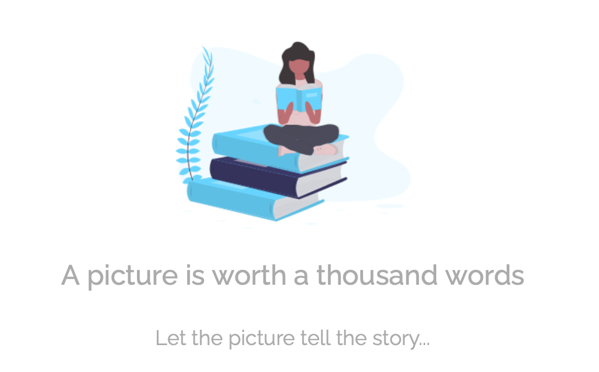
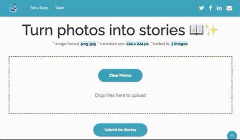
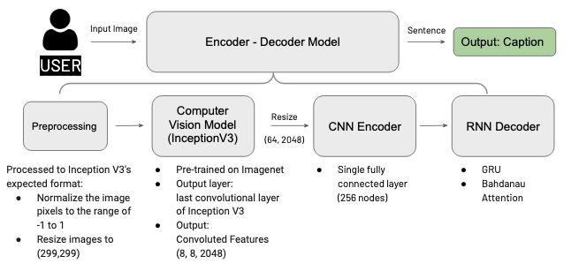
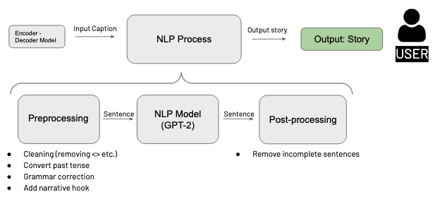
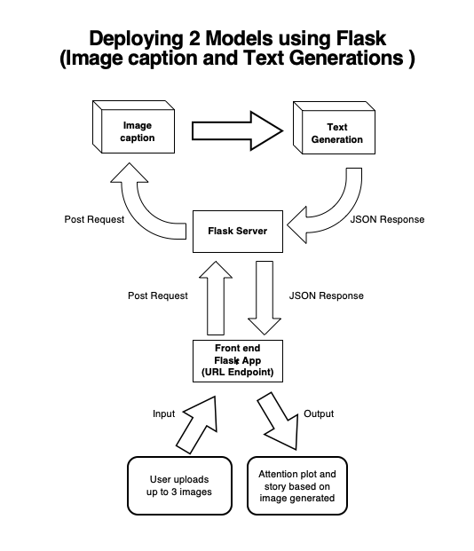

___

# Image Story Generator
___

A webapp created with FLASK API that utilizes computer vision and natural language processing to generate dramatic short stories using features from images.  

AI Apprenticeship Programme (AIAP®) Capstone Project- Aug 2020

---

## Table of Contents 

- [Site](#Site)
- [Description](#Description)
- [Getting Started](#Getting-Started)
- [Authors](#Authors)
- [License](#License)
- [Acknowledgements](#Acknowledgements)
- [Useful Resources](#Useful-Resources)


---
## Site

Landing page


\
Submit images



\
Generate attention plot and story


---
## Description

### Image to Caption



**Pre-processing**

The user submitted images were pre-processed to Inception V3’s expected format:
- Normalization to range: -1, 1.
- Resize images to (299,299)

**Encoder-Decoder**

Pre-processed images are passed through the convolutional layers of Inception V3. Features were extracted from the last convolutional layer giving us a vector of shape (8, 8, 2048).
The vector is squashed that to a shape of (64, 2048) and passed through the CNN Encoder (which consists of a single Fully connected layer). The RNN (GRU with Bahdanau Attention) attends over the image to predict a sequence of words that describe the image. The attention plots show which pixels in the image is weighted higher for each word.

### Caption to Story



**Pre-processing**  
Preprocessing was done on the Image Caption from the encoder-decoder model to help create
more “story-like” final outputs. This included:  
- Cleaning: Removing unwanted tags like ‘\<start>’ from the Image Caption  
- Convert to past tense: Transforming the tone of Image Caption from being more fact-based into something more narrative-like. This includes filling in missing singular verbs (e.g ‘a man sitting on a bench’ -> ‘a man was sitting on a bench’) and converting some present tense words (e.g ‘is’, ‘am’, ‘are’) into its past tense form.  
- Grammar correction: Correcting typographical and tense errors using the GrammarBot library.  
- Add a narrative hook: Adding a random narrative sentence to the start of the Image Caption, so outputs from GPT-2 model may inherit a narrative tone.  

The narrative hook is randomly chosen from a dataset comprising 9,000+ narrative opening
lines to a story (Janelle Shane’s Novel First Lines Dataset) crowd-sourced from actual novels
and input from users. The selection of the narrative hook is limited to narrative opening lines with 100 words or less to help avoid an overly specific or prolonged story premise.   
    
> Some examples of narrative opening lines:  
- It was love at first sight.
- A secret is a strange thing.
- "I don't understand."
- All this happened, more or less.
- I lead a double life.
- Sally Louisa Tomkins stood her ground.
- "Watch out!" yelled Pete Crenshaw.


Adding narrative opening lines help:
- introduce novelty 
- a good balance against the relatively descriptive, sterile Image Caption
- create synergy and serendipity with GPT-2 — the benefit comes from how GPT-2 might integrate the narrative hook with the Image Caption to generate a good narrative
- pique readers’ curiosity
- create an emotional investment or connection
- provide entertainment, via humour, suspense, or shock

**GPT-2**  

The preprocessed Image Caption is then passed into the GPT-2 model to generate paragraphs
of text. The maximum number of words for such paragraphs, in its aggregate, is set at 150.

**Post-processing** 

The last sentence of the paragraphs of text from the GPT-2 model is sometimes incomplete. In
such cases, the incomplete sentence is removed to arrive at our final output: the Story.

### Deployment (Webapp)



The web application was created using Flask, a micro web framework, which allows users to interface with the model through a webpage.  

---
## Getting Started

These instructions will get you a copy of the project up and running on your local machine for development.

### Prerequisites

Please install and update the following packages:

>numpy  
pandas  
tensorflow==2.3.0  
matplotlib==3.2.2  
json5==0.9.5  
pillow==7.2.0  
transformers==2.11.0  
grammarbot==0.2.0  
textblob==0.15.3  
regex  

The list of prequisites and versions can also be found in the requirements.txt file

To install the required packages, please use the following code:

```
conda install --file requirements.txt
```

### Installing

1. Clone this repo to your local machine  
```
git clone https://github.com/YOUR-USERNAME/YOUR-REPOSITORY 
cd repo
```

2. Go to the src folder, run downloadfile.py to download required files(size: __ GB)  
```
cd src
python -m downloadfile
```

3. Run web application locally  
```
flask run 
```
4. Open URL of locally hosted web app on web browser  
```
http://127.0.0.1:5000/
```
---
## Authors

* [**Chang Xuan Yao**](https://github.com/) - *Image to Caption*
* [**Guan Kiong Poh**](https://github.com/Unicorndy) - *Web Application*
* [**Josephine Lin**](https://github.com/jlinjy) - *Caption to Story* 
* [**Rebecca Lim**](https://github.com/rebeccalimxe) - *Image to Caption*
* [**Shaun Tan**](https://github.com/ShaunBleu) - *Caption to Story*

See also the list of [contributors](https://github.com/your/project/contributors) who participated in this project.

---
## License

This project is licensed under the MIT License - see the [LICENSE.md](LICENSE.md) file for details

---
## Acknowledgments

Models adapted from: 
* https://www.tensorflow.org/tutorials/text/image_captioning
* https://huggingface.co/gpt2

Web Application built with [Flask](https://palletsprojects.com/p/flask/) framework
Website designed with BootstrapMade  
Icons made by Freepik from www.flaticon.com  

---  
## Useful Resources
General  
Transformers v2.11.0: https://huggingface.co/transformers/v2.11.0/examples.html  
Fine-tuning GPT-2: https://openai.com/blog/fine-tuning-gpt-2/ and   https://minimaxir.com/2019/09/howto-gpt2/

Story and text generation   
https://towardsdatascience.com/how-to-fine-tune-gpt-2-so-you-can-generate-long-form-creative-writing-7a5ae1314a61  
https://medium.com/@pierre_guillou/faster-than-training-from-scratch-fine-tuning-the-english-gpt-2-in-any-language-with-hugging-f2ec05c98787  

GPT-3 explained  
https://www.youtube.com/watch?v=lQnLwUfwgyA  
https://www.youtube.com/watch?v=8psgEDhT1MM  
https://www.youtube.com/watch?v=_x9AwxfjxvE  

