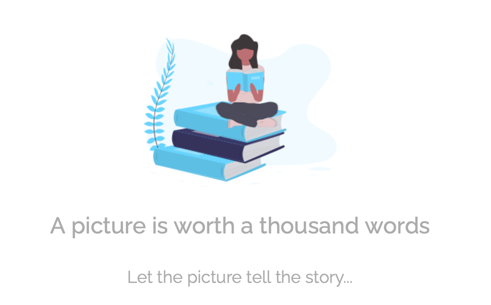

___

# Image Story Generator
___

A webapp created with FLASK API that utilizes computer vision and natural language processing to generate dramatic short stories using features from images.  

AI Apprenticeship Programme (AIAP®) Capstone Project- Aug 2020

[Badges?]

---

## Table of Contents 


- [Demo](#Demo)
- [Site](#Site)
- [Description](#Description)
- [Getting Started](#Getting-Started)
- [Deployment](#Deployment)
- [Built with](#Built-With)
- [Authors](#Authors)
- [License](#License)
- [Acknowledgements](#Acknowledgements)

---

## Demo

Here is a working live demo: __ URL


## Site

Landing page

[Demo Screenshots]

Submit images
[Demo Screenshots]


Generate story
[Demo Screenshots]


## Description


## Getting Started

These instructions will get you a copy of the project up and running on your local machine for development and testing purposes. See deployment for notes on how to deploy the project on a live system.

### Prerequisites

Please install and update the following packages:

flask==1.1.1  
numpy==1.18.5  
pandas==1.1.1  
tensorflow==2.3.0  
matplotlib==3.2.2  
json5==0.9.5  
pillow==7.2.0  
transformers==2.11.0  
grammarbot==0.2.0  
textblob==0.15.3  
regex>=2020.7.14  
 
The list of prequisites and versions can also be found in the requirements.txt file

To install the required packages, please use the following code:

```
conda install -c conda-forge textblob
```
### Installing

A step by step series of examples that tell you how to get a development env running

1. Clone this repo to your local machine using __  URL 
```
Give the example
```

2. Go to the src folder in the repo to download required files not in github repo. (size: __ GB)

```
$ cd src
$ python -m downloadfile
```

End with an example of getting some data out of the system or using it for a little demo


## Deployment


### Setup

update and install this package first

$ brew update
$ brew install fvcproductions


now install npm and bower packages

$ npm install
$ bower install

run flask run at the src folder


## Built With

* [Flask](https://palletsprojects.com/p/flask/) - Web application framework


## Authors

* **Chang Xuan Yao** - *Initial work* - [PurpleBooth](github act link)
* **Guan Kiong Poh** - *Initial work* - [PurpleBooth](https://github.com/PurpleBooth)
* **Josephine Lin** - *Initial work* - [PurpleBooth](https://github.com/PurpleBooth)
* **Rebecca Lim** - *Initial work* - [PurpleBooth](https://github.com/PurpleBooth)
* **Shaun Tan** - *Initial work* - [PurpleBooth](https://github.com/PurpleBooth)

See also the list of [contributors](https://github.com/your/project/contributors) who participated in this project.

## License

This project is licensed under the MIT License - see the [LICENSE.md](LICENSE.md) file for details

## Acknowledgments

* Our mentor, Daniel, for guiding us on this project  

Models adapted from: 
* https://www.tensorflow.org/tutorials/text/image_captioning
* etc


### Useful Resources
General
Transformers v2.11.0: https://huggingface.co/transformers/v2.11.0/examples.html
Fine-tuning GPT-2: https://openai.com/blog/fine-tuning-gpt-2/ and https://minimaxir.com/2019/09/howto-gpt2/

Story and text generation
https://towardsdatascience.com/how-to-fine-tune-gpt-2-so-you-can-generate-long-form-creative-writing-7a5ae1314a61
https://medium.com/@pierre_guillou/faster-than-training-from-scratch-fine-tuning-the-english-gpt-2-in-any-language-with-hugging-f2ec05c98787

GPT-3 explained
https://www.youtube.com/watch?v=lQnLwUfwgyA
https://www.youtube.com/watch?v=8psgEDhT1MM
https://www.youtube.com/watch?v=_x9AwxfjxvE


```python

```
